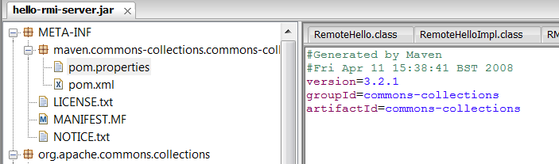
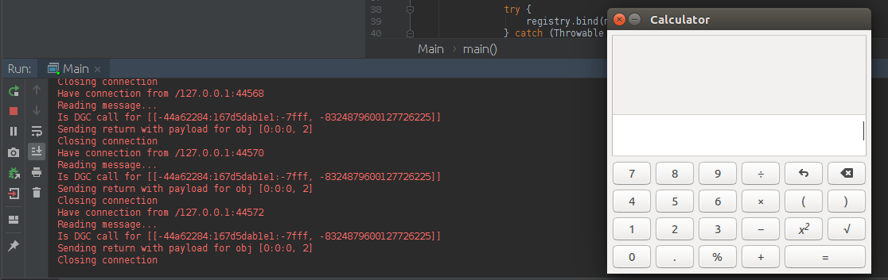

# RMI

During the Real World CTF Finals 2018 I took a short look at the RMI challenge. Not knowing a straight approach I moved on to the camera challenge, which also was solved 	eventually a few days after the finals. Yesterday I gave the RMI challenge another try and solved in basically no time. To be fair: Another team hinted that there was a Chinese blog article include much information and even half of an PoC for this challenge.

But step by step: RMI (Remote Method Invocation) is a Java feature to implement RPCs  (Remote Procedure Calls). Basically the RMI exposes some endpoints and a remote client can use the endpoint like in a local application. Since the RMI uses Java Object Serialization to transfer the objects between the server and client the protocol vulnerable to the well known Object Injection Exploits (see <a href="https://github.com/frohoff/ysoserial" target="_blank">ysoserial</a> for reference). If certain gadgets are present in the Java class path libraries, special crafted objects can trigger a RCE once they get deserialized.

The RMI challenge had quite a simple setup: Use the most recent JRE version (8u191) to exploit the provided RMI. Given was a JAR file that hosts a RMI server at port 1099. The RMI endpoint was a "Hello World" stub with the simplest imaginable implementation (and acutally not needed at all):

    public abstract interface RemoteHello extends Remote
    {
        public abstract String sayHello() throws RemoteException;
    }

    public class RemoteHelloImpl implements RemoteHello
    {
      public String sayHello() throws RemoteException
      {
        return "Hello, real world ctfer.";
      }
    }
    
The above mentioned RCE gadgets were also present in the JAR as revealed in the META-INF of the file:

The Apache Commons Collections are the most used library to gain RCE via a deserialization vulnerability. And it was even a old, unfixed version 3.2.1 of the library! The usual way to exploit this RMI is a one-liner:

`java -cp ysoserial.jar ysoserial.exploit.RMIRegistryExploit localhost 1099 CommonsCollections5 gnome-calculator`

This command creates an RMI client and sends the CommonsCollections5 RCE object payload to the RMI server, triggering the "gnome-calculator" command once its processed by the RMI. Or at least it would in an older JRE version. Starting with JRE 8u121 an "<a href="https://github.com/JetBrains/jdk8u_jdk/blob/master/src/share/classes/sun/rmi/registry/RegistryImpl.java" target="_blank">RMI RegistryFilter</a>" was included.

    If (String.class == clazz
                        || java.lang.Number.class.isAssignableFrom(clazz)
                        || Remote.class.isAssignableFrom(clazz)
                        || java.lang.reflect.Proxy.class.isAssignableFrom(clazz)
                        || UnicastRef.class.isAssignableFrom(clazz)
                        || RMIClientSocketFactory.class.isAssignableFrom(clazz)
                        || RMIServerSocketFactory.class.isAssignableFrom(clazz)
                        || java.rmi.activation.ActivationID.class.isAssignableFrom(clazz)
                        || java.rmi.server.UID.class.isAssignableFrom(clazz)) {
                    return ObjectInputFilter.Status.ALLOWED;
                } else {
                    return ObjectInputFilter.Status.REJECTED;
                }
                

The RMI Objects are reduced to only a few classes, rejecting the "AnnotationInvocationHandler" used by the RCE gadget as seen in the screenshot.

Long story short: I finally found the mentioned <a href="http://www.codersec.net/2018/09/%E4%B8%80%E6%AC%A1%E6%94%BB%E5%87%BB%E5%86%85%E7%BD%91rmi%E6%9C%8D%E5%8A%A1%E7%9A%84%E6%B7%B1%E6%80%9D/" target="_blank">chinese blog article</a> about bypassing the RMI on page 5 on the google results. 

*(I don't have deep knowledge of Java internalGooglethe following few sentences are very vague and might be even wrong)* The PoC in the blog article uses the `UnicastRef` class. The Java RMI provides a distributed garbage collection among clients. The object refs are tracked by the `LiveRef` class, storing the `objectId` along with a tcp endpoint of the destributed GC. This `LiveRef` can be wrapped in a `UnicastRef` object allowed by the registryFilter! Once the object gets garbage collected, the remote garbage collector is notified and returns a serialized BadAttributeValueExpException to the RMI which contains the RCE payload. This serialized object is not checked by the registryFilter, yielding the RCE we wanted to achieve. 

The author of the chinese blog article provides in total four methods to bypass the filter, this way seemed the easiest. The other ways make essentially the same, but using proxy methods and dynamic invokes on the wrapped UnicastRef object.

Fortunatly the malicious remote GC listener is <a href="https://giFortunatelyrohoff/ysoserial/blob/master/src/main/java/ysoserial/exploit/JRMPListener.java" target="_blank">already implemented</a> in ysoserial . So all we need to do is:

1. Start a JRMP Listener
2. Arm the listener with the CommonsCollections 3.2.1 payload
3. Create a UnicastRef Object with a LiveRef to the remote GC
4. Register the UnicastRef Object at the RMI
5. Profit

Commented <a href="Main.java" target="_blank">sourcecode</a> attached. I'd highly appreciate it if someone corrects me on the whole remote GC and JRMP stuff. Unfortunatly I couldn't find information except for the raw java sources.