# 1337 (Reversing 500)

There was a quite interesting, but also frustrating windows reversing challenge at CSAW quals 2018. Only 4 teams solved the task in time and it got upgraded from 300 to 500 points since it got no solves after more than a day. Unfortunately, my team ALLES! didn’t solve it in time because of a tiny bug in our implementation. That mistake cost us the first place, but anyways, heres the writeup:

As usual in windows reversing the file gets loaded with CFF Explorer to obtain some standard information like the filetype (32 bit), suspicious sections (`UPX0` and `UPX1`, both red herrings) and an overview of the imports (`KERNEL32.dll` and `USER32.dll`, nothing special). Note that `GetProcAddr` and `LoadLibraryExA` is imported, so there are probably more APIs imported at runtime…

Loading the file in IDA we inspect the main method. It runs in an endless loop, which is quite unusual for a console application since only UI applications use a message loop. The code is a mess, probably also due to the various obfuscations we come around later on. Let’s dive in and begin with some dynamically analysis, since the static code is a mess.

Starting the 1337.exe with my favorite debugger x64dbg we notice a “Nope”-MessageBox. A debugger detection! Luckily only a simple one, we can hide the debugger in the PEB data (x64dbg can do this for us) and all debugger checks are bypassed. Tracing the `IsDebuggerPresent()`-Call (which actually uses the PEB for the check), we can find a call from the main function to this debugger check function (`0x00510AF0`). Let’s trace the user input: Let the program run until it asks for the console input. Suspend the main thread and trace the stack till we find a return to the 1337.exe

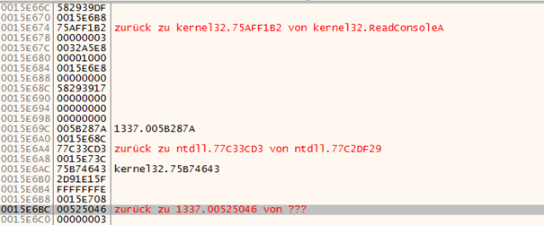

`ReadConsoleA` sounds good, but its only an internal API call. We are interested in the call of the 1337.exe module, which is actually a `ReadFile` call with the console handle.
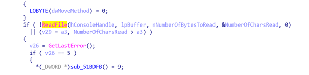

Knowing this location, we can trace the `lpBuffer` variable. It gets copied to a string (`0x00524A71`) and is returned. Eventually we arrive at `0x005755E3` where 8 bytes of input is pushed to the stack and the function `0x00528100` is called.
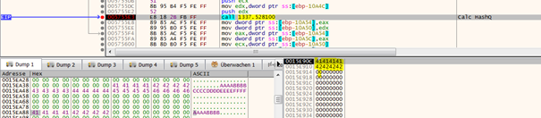

We handle this function as a black box for now. There is a 8 byte userinput segment and 8 byte output is returned in the registers EAX and EDX. Actually it’s a 64 bit number that gets passed in two registers. Keep in mind the 32 Bit context ;) This function gets called multiple times, passing all the 8 byte separated userinput to this black box function. Tracing the output of this black box function (memory BPs) we finally arrive at 0x00577098, `call eax`.
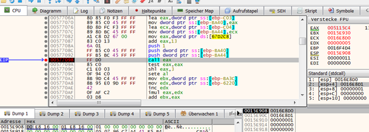

The first argument of this function call (as seen in the stack) is an address `X`, the second argument is address `X+1`. The third argument is simply a `1`, and static! The first argument is actually a byte of the output of the black box function, the second argument is static and comes from a decrypted string buffer. Lets analyze the function that gets called (`0x005115C4`).

The pseudocode of this function is 1900 lines, sweet! But we’re lucky, the third argument is always 1. And so the function reduces to a few lines:
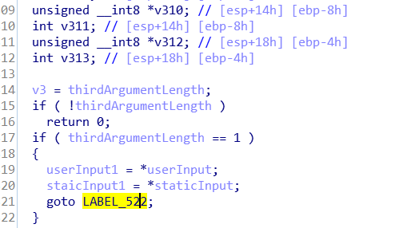
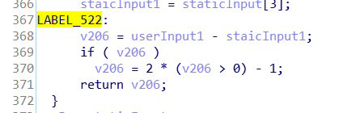

A few lines later, tracing the value of `EBX`:
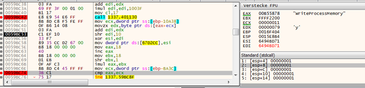
 
The string “WriteProcessMemory” (another red herring) is used to calculate a static byte value: `0x12C`. And this value is compared to `ECX`, which should match. If we toggle the `ZF` to negate the comparison, we jump to the “good flag” function: 
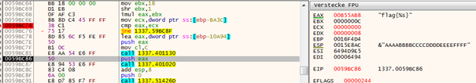
 
Cool, task solved! Nah not really, we have to find the matching values for the static buffer. And for this, we have to analyze the black box functions which transforms the user input to an “hash” that is compared with the static buffer. 
We’d like to use IDA pseudocode to analyze this input transformation function, but a clever obfuscation technique hinders IDA to do so:
 
 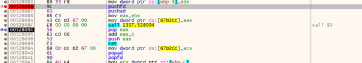
First all registers are saved, then the “function” is called, basically pushing the return address to the stack and jumping to the next line. The return address is popped from the stack, increased and pushed back, now pointing to the instruction right before the popad. A ret jumps to this place. So those lines basically do nothing, but disturb the stack analysis of IDA. If we NOP all those instructions, we get nice pseudocode:
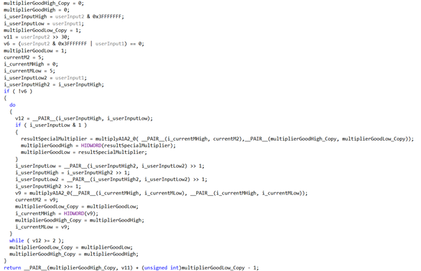

All this code reduces to:
```python
def algo2(power):
    base = 5
    accum = 1
    p = power & (0x3FFFFFFFFFFFFFFF)
    highbit = power >> (30+32)
    while True:
        if p & 1:
            accum = multip(base, accum)
        p = p >> 1
        base = multip(base, base)
        if (p <= 2):
            break;
    return accum + highbit - 1
```
In an even simpler form the calculation is reduced to: `pow(5,INPUT, 2^64)`. Lets verify this thesis with some input (we take “AAAABBBB” = 0x4141414142424242):
```
>>> hex(pow(5,0x4242424241414141,2**64))
'0xb4f541a4c7960705L'
```
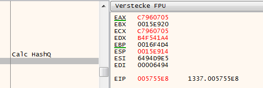
We got the right values stored in our registers! This means we have to solve a discrete logarithmic problem in the form a^x mod N = b with a=5, N = 2^64 and b given from the comparison buffer. Sage can solve this problem effectively and it worked well for our generated input. 
```python
def reversealgo(inp):
    F = Integers(2**64)
    rev = F(inp+1).log(5) + 2**63 - 2**62
    assert algo(int(rev)) == inp
    return rev
```
But the static comparison buffer values were: 
```
0xbeb9e408e58575b0
0xb8f8437f04f80044
0xc227df7146b09474
```
Notice how all of them are even numbers, which can’t be calculated using `5^x` for any `x`! We simplified the algorithm too much and missed that the last to bits of the user input is stored and appended to the output (highbit in the python code). This way even numbers are possible. Without this mechanism those numbers wouldn’t be unique, as seen in this example:
```
>>> hex(pow(5,0x3333333312345678,2**64))
'0xab0057c4f85cb421L'
>>> hex(pow(5,0x7333333312345678,2**64))
'0xab0057c4f85cb421L'`
```
But the algorithm of the 1337.exe handles the first case as `0xab0057c4f85cb420`. Using this knowledge, we could simply add a `1` to the static input buffer, solve the discrete log problem and discard the MSB of the result, yielding the searched input. 
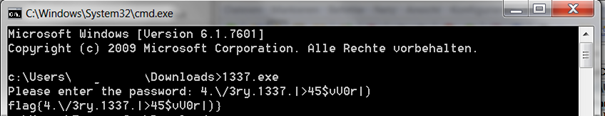

There were various other obfuscation strategies used in this binary. Parts of functions were just NOPs for 200 instructions, other functions called the very same function multiple times in a normal control flow. And the static comparison buffer was depended on the user input length! That means if you just tested with a 9 character input you got a slightly different comparison buffer than with a 17-character input. The real comparison buffer was only decrypted when the user provided a 24-character input.
Furthermore, the `LoadStringA` function (which was used for the string decryption) returned a proper buffer only if the string was loaded in cp1255 encoding. This hint was released later on.


