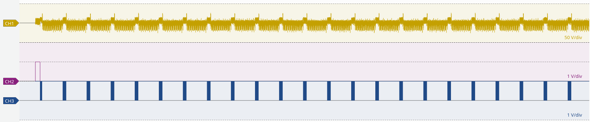
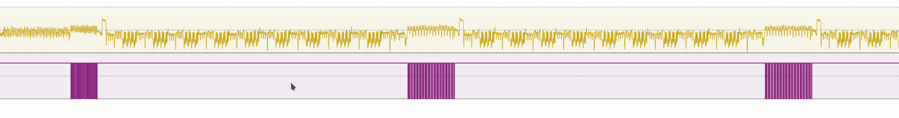
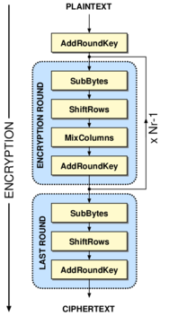
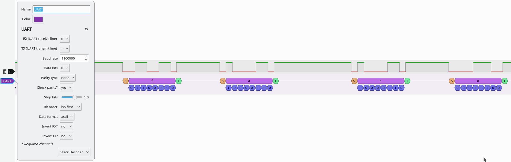
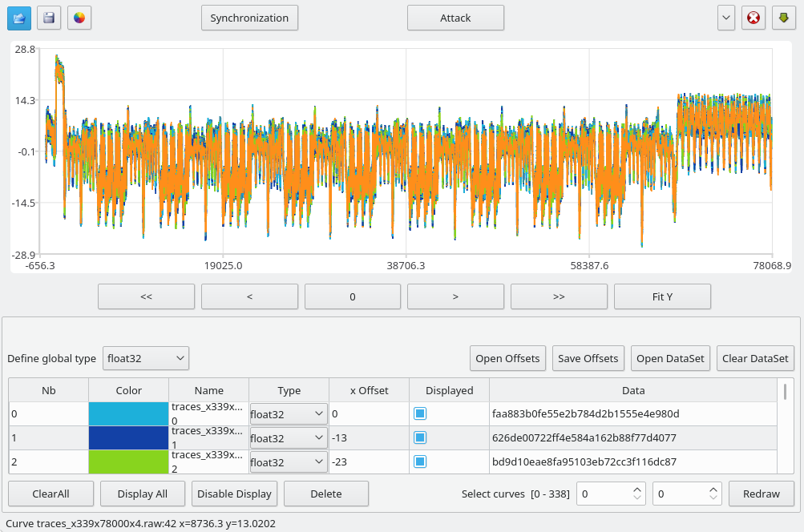
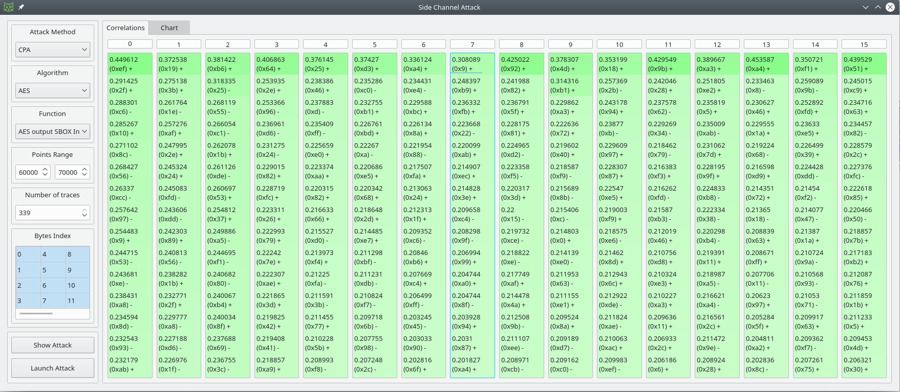

# Measurement
- Tags: Crypto, DPA
- Points: 1203
- Solves: 3

## Challenge
>It is curious what you can find out by measuring... 

We get 4 csv files, all very similar. They contain 4 columns:
```
Time,Channel A,D15,D12
(ms),(mV),(Binary),(Binary)
```

Later on a basic hint was released, containing some redacted c code showing AES-CBC in a loop and an image of the traces. 

## Solution
The task is to do a differential power analysis of the signal in the CSVs. They contain a time, a voltage and two binary signals.
In each csv we have 500ms worth of data. Likely the size of sample buffer of the recording device.

### Visualizing data
First we wanted to get an overview over the data. Using a short python script we can quickly verify that we have equidistant sampling, with a samplingrate of around `17857129`.

Next we want to open the traces in pulseview. Unfortunately, we cannot directly import the CSV, as the CSV importer does not currently support analog input data. We work around this by converting all our values to analog (even the binary channels), and then importing them via 'Raw Analog without Header'. This is done in python:
```python
import numpy as np
# quite slow, but works. Way faster with pandas read_csv method
data = np.genfromtxt('1.csv',delimiter=",", skip_header=2)
data[:,1:4].astype(np.float32).tofile('1.raw')
```

This file can be imported into PulseView with 'Import Raw analog data without header' using `FLOAT_LE` as format and 3 analog channels. We see a very regular structure:

It seems that our hardware gets some in/output, then does encryption, then in/output again, repeating.
CH2 (D15) is a synchronization pulse, CH3 (D12) is the digital in/output and our powertrace consists of repeating patterns:


We can easily see the phases of [AES-128](https://en.wikipedia.org/wiki/Advanced_Encryption_Standard) in the powertrace! Especially the 9xMixColumns operation is noticable. AddRoundKey is a very short operation, so not very visible in the trace. SubBytes, ShiftRows and MixColumns are distinct.

I find it helpful to compare to this AES-Flowchart:



from [Design and Implementation A different Architectures of mixcolumn in FPGA](https://www.researchgate.net/figure/The-basic-AES-128-cryptographic-architecture_fig1_230853805) 
 licensed under [CC BY](https://creativecommons.org/licenses/by/4.0/).


### Extracting Ciphertexts
Knowing that we have to do a DPA, we need either the plain or ciphertext of each encryption. This is likely given in channel D12. To decode it, we have to guess the used protocol. Since we have no clock channel, only UART seems likely. Using PulseView we can use the UART decoder to view the content. To do this, we have to determine the Baud Rate. Since standard baudrates did not work, we simply tried to increase it until the individual bits lined up with the expected bit-widths. We ended up with a baud rate of `1100000`:

The decoded data is composed of 32 char long hex strings! Exactly one block size in AES-128.

Knowing these parameters we have to extract the data. Using PulseView alone this is tedious. While we can export the annotations by `Right-Click -> Export All Annotations`, the output is way to verbose:
```
...
8857016-8857033 UART: RX: Stop bit
8857233-8857250 UART: RX: Start bit
8857249-8857380 UART: RX: 6
8857249-8857266 UART: RX bits: 0
8857266-8857283 UART: RX bits: 1
8857282-8857299 UART: RX bits: 1
8857298-8857315 UART: RX bits: 0
8857314-8857331 UART: RX bits: 1
8857331-8857348 UART: RX bits: 1
8857347-8857364 UART: RX bits: 0
8857363-8857380 UART: RX bits: 0
8857379-8857396 UART: RX: Stop bit
8857502-8857519 UART: RX: Start bit
...
```

A better solution is to use sigrok, the signal processing suite used by PulseView, directly. The simplest way to do this, is to extract just the relevant channel D12 from the csv using `xsv`, then use `sigrok-cli` to parse the UART. Since sigrok's CSV import chokes on headers, we need to strip them.
```
xsv select D12 1.csv | tail -n +3 > uart1.csv
sigrok-cli --protocol-decoders uart:baudrate=1100000 -i uart1.csv -I csv:samplerate=17857129 -B uart=rx > uart1.txt
```
results in
```
Here is your message:
faa883b0fe55e2b784d2b1555e4e980d
626de00722ff4e584a162b88f77d4077
bd9d10eae8fa95103eb72cc3f116dc87
452ced775a8f9b581046841d8f3c575f
ffb0babc0c9f3f6b28444c6b2d0ba120
b8624815d45015b81a8beb44d286985f
bf5a0ce698a2a2ad8c3456adb8139794
0f8574788c81de33bd373c5b69f15274
0f8f090c01c23b40d9bb0b1090f747e5
```

Since the output starts with `Here is your message:`, the following hexstrings are likely ciphertexts. This will make DPA slightly more complicated.

### Extracting Traces
To perform DPA we need many power traces of the encryption with the corrosponding plain/ciphertexts. Depending on the tool we use, they have to be in a different format. But in general we cannot just use one long input trace, we have to split it at each encryption. We do this by looking at the packet-borders in D12.

Since we later use qscat to perform the DPA, we already save the data in the correct formats and filenames. qscat filenames encode the structure of raw data: `{NAME}_x{traceCount}_x{traceLength}_x{bytePerValue}`.

```python
import numpy as np
import pandas as pd

trace_length = 78000 # target length of each trace
packet_gap = 10000 # minimum sample-gap between two packets
packets = []
ciphertexts = []

# in 4.csv the program gets restarted, thus the packets dont line up.
# could be implemented here, but 3 is enough to get flag.
for csvname, uartname in [('1.csv','cleanedcsv/1.txt'), ('2.csv','cleanedcsv/2.txt'), ('3.csv','cleanedcsv/3.txt')]:
    #data = np.genfromtxt(csvname,delimiter=",", skip_header=2)
    data = pd.read_csv(csvname, skiprows=2).values

    # determine locations of 0's in D12 (uart-high)
    bitlocs = (data[:,3]==0).nonzero()[0]
    # add last index as pseudo 0
    bitlocs = np.r_[bitlocs, len(data[:,3])]
    # find 0's with 10000+ following 1's -> end of packet
    packet_borders = bitlocs[np.argwhere(np.diff(bitlocs) > packet_gap)].flatten()
    # split power trace by borders, remove first and last packet, which could be incomplete
    new_packets = np.split(data[:,1], packet_borders)[1:-1]

    with open(uartname, "r") as f:
        ciphers = f.readlines()

    packets += new_packets
    ciphertexts += ciphers[1:1+len(new_packets)]

    print "Parsed %s: %d packets found" % (csvname, len(new_packets))

# gather all packets into one array
traces = np.empty((len(packets), trace_length), dtype=np.float32)
for i, packet in enumerate(packets):
    assert packet.shape[0] > trace_length, "packet %d to small!: %d" % (i, packet.shape[0])
    traces[i,:] = packet[:trace_length]

# save array as raw to disk. filename compatible with qscat
traces.tofile("traces_x%dx%dx4.raw" % traces.shape)
np.save("traces.npy", traces)

# also save ciphertexts in a raw format
with open('ciphertexts.raw', 'wb') as f:
    f.write("".join([c.strip().decode('hex') for c in ciphertexts]))

print "Found %d traces!" % len(packets)
```

### DPA
#### Quick Intro
I'm no expert in DPA, so take this with a grain of salt.

##### Attacking known Plaintext + Powertrace

Naive AES is weak to power trace analysis since the power use at the output of the subbytes operation leaks information on how many bits were set in the sbox-output. The more bits are set, the more energy is needed.

Recall the AES-Flowchart above: First we add the roundkey to our plaintext, then we do subbytes. We can now mount a guess on the roundkey byte-by-byte, comparing the resulting sbox output to our power usage. If we observe high power usage, it is likely that the sbox output had many bits set.

Attacking the sboxes works so well, since they are on purpose highly non-linear. This means even a slightly wrong guess on our part will result in 'random' output. Averaging over many traces, we can thus determine the correct key with confidence.

Since for the first round, the roundkey is the aes key, we are done.

##### Attacking known Ciphertext + Powertrace
Attacking known Ciphertext is slightly more complicated, since we have to attack the last round: SubBytes, ShiftRows, AddRoundKey. Since we know the output after AddRoundKey, mounting a guess will give the output of ShiftRows.

But ShiftRows can be ignored, since it just swaps around the bytes a bit, without modifying them. This means the SubBytes lookups are the same, just in a different order. But we don't care about order anyways, so this is fine.

Since we are now guessing 'behind' an sbox, we invert the sbox for our lookups (use the one for decrypting aes). For each key-byte guess this gives us an assumption of an input value to the sbox. This value is then compared to our power usage.

The result of this attack will be the last roundkey. To decrypt we need the first roundkey. Luckily the AES keyschedule is easily invertible.

#### Mounting the attack
There are multiple tools which can do DPA attacks. I found Chipwhisperer, Daredevil and qscat. Since I was following a [RHME writeup](https://github.com/SideChannelMarvels/Deadpool/tree/master/sca_aes_rhme3_prequal/DPA), I started with qscat, which was able to solve the challenge. Is is quite basic, but has a nice GUI.

To load our data, we first go on open in the top left and select our `traces_x339x78000x4.raw` file. In addition we need to load our known ciphertexts by doing `Open DataSet` on the bottom right and selecting the `ciphertexts.raw` file. By clicking `Display All` below we get a nice representation of our traces, which we use to find our attack point.



To mount the attack we have to identify where the subBytes of the last round takes place. We find it immediately after the last mixColumns step, from sample 64000 to 66000.

Now the attack works better if our traces are perfectly aligned. We already did quite a good job when extracting them, so in this specific case the attack works even without further alignment. But applying additional alignment increases the confidence in the result.
qscat currently only offers 'Sum Of Differences' alignment, so we use that. Reference pattern is Curve 0 from 64000 to 66000, window search's default of -300 to 300 is adequate. The actual calculated offsets are in the range +-50 samples.

Now we can finally launch our attack. Click `Attack`, choose 'AES output SBOX Inv' as function, specify the Points Range as 64000-66000, and select all key bytes:



When doing it wrong, all keys have about the same confidence (on our traces with wrong parameters around 0.25). A good attack as seen above gives us a values of up to 0.45.

We get the (most likely) last round key as `ef 19 b6 64 25 d3 a4 09 92 4d 18 9b a3 a4 f1 51`

To get the first round key we use the `aes_keyschedule` tool from the [Stark Repository](https://github.com/SideChannelMarvels/Stark):
```
./aes_keyschedule ef19b66425d3a409924d189ba3a4f151 10 
K00: E286DA78AF303F545F6DEAC0A507B1D3
K01: 264EBC7E897E832AD61369EA7314D839
K02: DE2FAEF157512DDB81424431F2569C08
K03: 6BF19E783CA0B3A3BDE2F7924FB46B9A
K04: EE8E26FCD22E955F6FCC62CD20780957
K05: 428F7D4B90A1E814FF6D8AD9DF15838E
K06: 3B6364D5ABC28CC154AF06188BBA8596
K07: 8FF4F4E82436782970997E31FB23FBA7
K08: 29FBA8E70DCDD0CE7D54AEFF86775558
K09: C707C2A3CACA126DB79EBC9231E9E9CA
K10: EF19B66425D3A409924D189BA3A4F151
```


### Decryption
Using the key `E286DA78AF303F545F6DEAC0A507B1D3` we can now finally decrypt our data, right? Well, partially. The hint published sometime during the challenge tells us that is is AES-CBC, which means we need an IV. Using a wrong IV (eg 0), we get almost the whole output, just missing the first block. Ofcourse, the flag is in this first block. But since we know the flag format is `midnight{` we can get the first 9 bytes of the IV: `incompreh`. This is enough to guess the rest of the IV as `incomprehensible`
```python
from Crypto.Cipher import AES

with open('uart1.txt', 'r') as f:
    output = f.readlines()
c = [o.strip().decode('hex') for o in output]

key = "E286DA78AF303F545F6DEAC0A507B1D3".decode('hex')

# get iv part
cipher = AES.new(key, AES.MODE_ECB)
first = cipher.decrypt(c[0])
print "IV Part:", "".join([chr(ord(a) ^ord(b)) for a,b in zip(first, "midnight{")])

# use guessed iv to decrypt
cipher = AES.new(key, AES.MODE_CBC, iv="incomprehensible")
print cipher.decrypt("".join(c))
```

```
IV Part: incompreh
midnight{kall_AES_kaviar_is_perfect_on_knaeckebroed}

CRISPBREAD

Alternative names: Hard bread
Type: Cracker
Place of origin: Sweden
Main ingredients: Rye flour, salt, water

Crispbread  (Swedish: knäckebröd, hårt bröd, hårdbröd, spisbröd,
knäcke) is a flat and dry type of cracker, containing mostly rye flour.
Crispbreads are light and keep fresh for a very long time. Crispbread is a
staple food and was for a long time considered a poor man's diet. However, in
recent years there has been renewed interest in crispbread in the Nordic
countries.

Crispbread has been baked in central Sweden since 500 AD (CE). It was made as
round wafers with a hole in the middle so the bread could be stored on sticks
under the roof. Traditional crispbread was invented about 500 years ago.
Finland and Sweden have long traditions in crispbread consumption, and
crispbread has been known in most households since the 1800s. Traditionally,
crispbreads were baked just twice a year; following harvest and again in the
spring when frozen river waters began to flow. Traditional western Finnish
crispbread was (and still is) made in the form of a round flat loaf with a hole
in the middle to facilitate storage on long poles hanging near the ceiling.
Sweden's first industrial crispbread bakery, AU Bergmans enka, began its
production in Stockholm in 1850. Rectangular Knäckebrot was first manufactured
in Germany in 1927 and has remained popular and readily available there ever
since.
.....
```


# References
- https://github.com/SideChannelMarvels/Deadpool/tree/master/sca_aes_rhme3_prequal/DPA
- https://github.com/SideChannelMarvels/Daredevil/wiki
- https://wiki.newae.com/Tutorial_B6_Breaking_AES_(Manual_CPA_Attack)
- https://crypto.stackexchange.com/questions/47680/what-is-the-difference-between-perfoming-correlation-power-analysis-cpa-in-the
- https://web.archive.org/web/20170829162736/https://people.rit.edu/kjm5923/DPA_attacks_on_AES.pdf